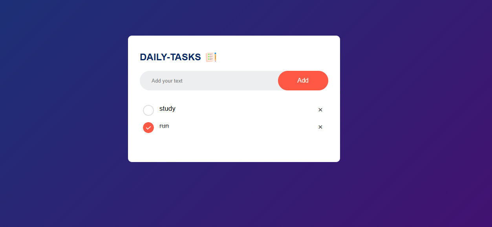

# 📝DAILY-TASKS Web App

## 📌 Overview
The **DAILY-TASKS Web App** is a simple and interactive task management application that helps users organize their daily tasks efficiently. Built with modern web technologies, this app allows users to add, edit, mark as completed, and delete tasks effortlessly.

## 🚀 Features
- 🆕 Add new tasks
- ✅ Mark tasks as completed
- ✏️ Edit existing tasks
- 🗑️ Delete tasks
- 📌 Persistent storage using local storage / database
- 📱 Responsive design for mobile and desktop

## 🛠️ Technologies Used
- **Frontend:** HTML, CSS, JavaScript (React.js)
- **Backend:** Node.js 

## 🖼️ Screenshots

## 🌍 Live Demo
Check out the live demo: [Live App](https://subu-4494.github.io/DAILY-TASKS/)

---

